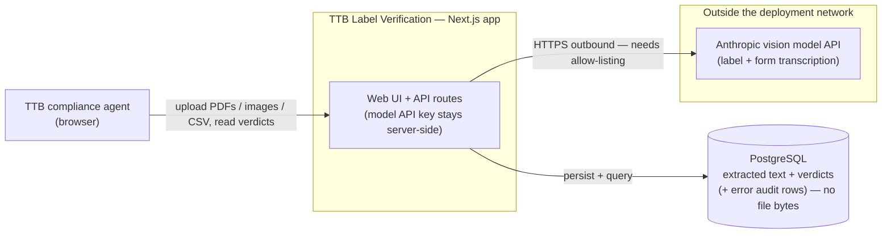
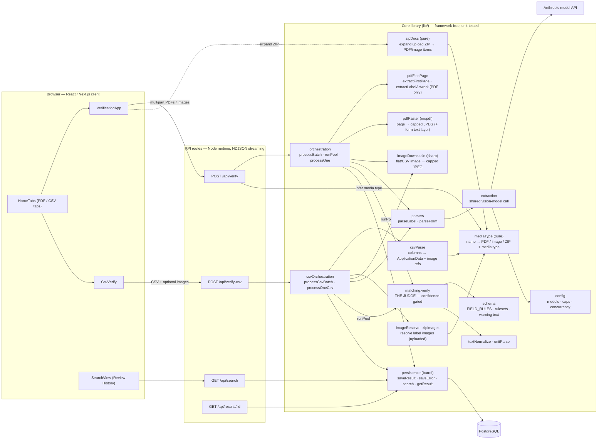

# Architecture

Three views of the system, from outside in:

1. **System context** — the app and the things outside it.
2. **Components** — the modules inside the app and how the two intake paths converge.
3. **Verification sequence** — what happens, in order, for one application.

The diagrams are Mermaid and render inline on GitHub. The guiding principle to
keep in mind while reading them: **the model transcribes verbatim; deterministic
code judges.** Every compliance decision lives in `lib/matching.ts`, never in a
prompt.

---

## 1. System context

A single Next.js deployable plus a database, talking to exactly one external
service: the vision model. The dashed box is the trust/network boundary — the
only outbound traffic is to the model API, which in a locked-down federal network
must be allow-listed (or, more likely in production, swapped for Claude on in-VPC
AWS Bedrock — a localized change at `extraction.ts`; see README limitations).
Label images are always uploaded by the agent, never fetched, so there is no
outbound image traffic and no SSRF surface.



Notes:
- **No COLA integration** — this is a standalone proof-of-concept by design.
- **Retention:** only extracted text and verdicts are stored — plus, for items
  whose processing failed, an `overall='error'` audit row (file/row name + error
  message) so failures don't vanish from history. Uploaded PDFs and label images
  are processed in memory and discarded; no file bytes are ever persisted.
- **CSV label images are uploaded, never fetched** (loose files and/or a ZIP) —
  no outbound image request, the safer choice in a restricted network.

---

## 2. Components

Two intake fronts — the **upload tab** (combined PDFs or flat images) and
**CSV** — converge on one shared spine (`runPool` → `matching.verify` →
`persistence`). On the upload front a PDF is sliced (page 1 = form, artwork pages
= label) and each slice is rasterized to resolution-capped JPEGs (`pdfRaster`,
the form page accompanied by its extracted text layer), while an image can't be
sliced, so the one image is downscaled (`imageDownscale`) and read by both
parsers; a dropped ZIP is expanded client-side (`zipDocs`) into individual
PDF/image items.
The CSV path swaps the *front* entirely: application data comes from columns and
label images are resolved by name from the uploaded images (loose files and/or a
ZIP). From matching onward all paths are identical.



Reading aids:
- **`matching.verify` is the only judge.** Both fronts feed it; it reads the
  rules from `schema.ts` and resolves each field with a tolerant / numeric /
  strict matcher, gated by read confidence.
- **`extraction` is label/form-agnostic** — one shared model integration; the
  model id is a per-call argument (label defaults to a faster tier, form to the
  general one; see `config.ts`).
- **An image is an un-sliceable PDF.** `mediaType` (the single source of file-type
  knowledge, shared by the route, `zipDocs`, `csvParse`, and `imageResolve`) tells
  `processOne` whether to slice the PDF or feed the one image to both parsers. No
  separate image route or parser exists — only the media type differs.
- **`persistence` is a barrel** — the rest of the app imports from it, not from
  `db`/`persistWrite`/`persistQuery` directly.

---

## 3. Verification sequence (one PDF or image application)

The runtime view: slice → rasterize → transcribe (two models, concurrently) →
judge → persist → stream, with results flowing back per item rather than after
the whole batch (the per-label latency requirement). Slice + rasterize are
PDF-only steps; an image skips them and is downscaled, then read whole by both
parsers. Rasterization caps every page at the model's native resolution
(`VISION_MAX_EDGE_PX`) and pairs the form page with its extracted text layer;
any rasterization failure falls back to sending that PDF slice as-is.

```mermaid
sequenceDiagram
    actor Agent
    participant UI as VerificationApp (browser)
    participant API as POST /api/verify
    participant Pool as runPool / processOne
    participant Slice as pdfFirstPage
    participant Model as Anthropic API
    participant Judge as matching.verify
    participant DB as Postgres

    Agent->>UI: drop combined PDF(s) or image(s)
    Agent->>API: process queued applications (multipart)
    API->>API: migrate(), infer media type per file, build the work list

    loop each application (bounded concurrency)
        API->>Pool: processOne(item)
        opt PDF input (an image skips this — it is downscaled, then feeds both parsers)
            Pool->>Slice: extractFirstPage (form → page 1)
            Pool->>Slice: extractLabelArtwork (label → image pages)
            Pool->>Pool: rasterize both slices → capped JPEGs<br/>(form + its text layer; PDF fallback on failure)
        end
        par label + form, concurrently
            Pool->>Model: parseLabel (Haiku)
        and
            Pool->>Model: parseForm (Sonnet)
        end
        Model-->>Pool: verbatim field values + per-field confidence
        Pool->>Judge: verify(label, app, confidence)
        Note over Judge: deterministic + confidence-gated.<br/>Government warning checked strictly.
        Judge-->>Pool: per-field verdicts + overall
        Pool->>DB: saveResult (non-fatal — a lost write never drops a verdict)
        Note over Pool,DB: a FAILED read short-circuits before the judge and<br/>persists an overall='error' audit row instead (saveError)
        Pool-->>API: ItemOutcome
        API-->>UI: NDJSON result line (streamed)
        UI->>UI: reducer appends the row
    end
    API-->>UI: summary
```

**Image variant.** Same diagram with the `opt` slicing block skipped: the one
uploaded image (which shows the whole application) is downscaled to the vision
cap once and fed to both the label and form parsers. Everything from
transcription onward is identical.

**CSV variant.** Same diagram with the front swapped: instead of slicing a PDF
and model-reading the form, `csvParse` turns the row's columns into the
application data, and `imageResolve`/`zipImages` resolve the label images by name
from the uploaded set (loose files and/or a ZIP) and downscale them to the same
vision cap. The label is still model-read;
`verify`, persistence, streaming, and the shared `runPool` are identical.

---

## Why these choices

- **One vision model, not OCR-then-parse** — fewer moving parts; the model reads
  degraded artwork better than a brittle OCR pipeline.
- **Model transcribes, code judges** — verdicts are deterministic, testable, and
  auditable; the model can't "decide" compliance.
- **Confidence gate** — a low-confidence read routes to *review*, never a
  confident *fail*; the government warning is the deliberate exception.
- **Two paths, one judge** — PDF and CSV share matching, persistence, streaming,
  and the worker pool, so they can't drift.
- **Streaming over batch-blocking** — results land per application (~seconds),
  not after the whole batch. This is why each extraction is a synchronous
  `client.messages.create` call (label + form per item), parallelized by
  `runPool` — **not** Anthropic's asynchronous Batch API.
- **Relational store, text + verdicts only** — portable across any Postgres;
  no document bytes retained.

## Possible optimizations

- **Batch API for non-interactive CSV runs.** The model calls use the synchronous
  Messages API so verdicts can stream into the table live. Anthropic's
  [Message Batches API](https://docs.anthropic.com/en/docs/build-with-claude/batch-processing)
  is ~50% cheaper but asynchronous (up to 24h turnaround), so it can't feed the
  per-item stream the UI is built around. For large **CSV bulk** jobs where live
  results aren't needed, routing those extractions through the Batch API would cut
  model cost roughly in half. It's a separate submit → poll → persist flow (not a
  drop-in swap) and would forgo streaming for that path, so it's worth it only if
  bulk cost becomes a real concern.
