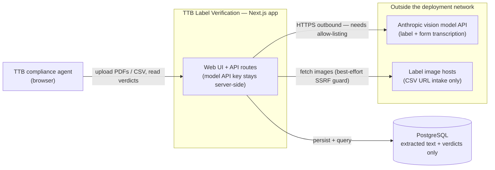
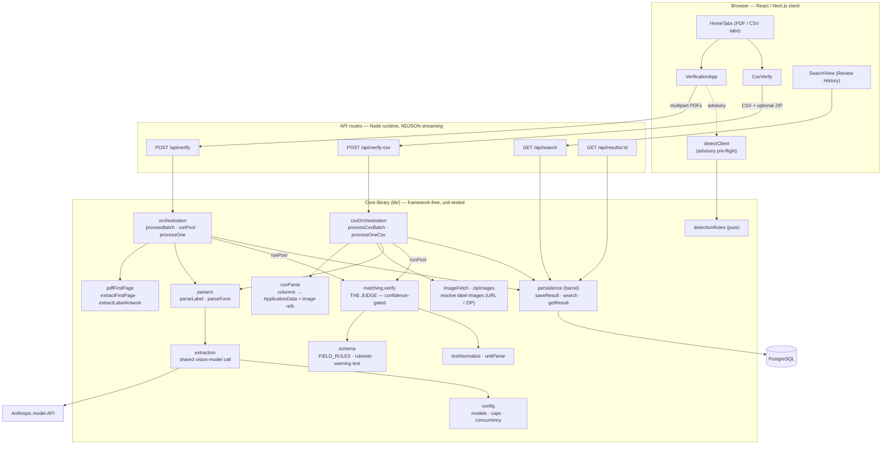
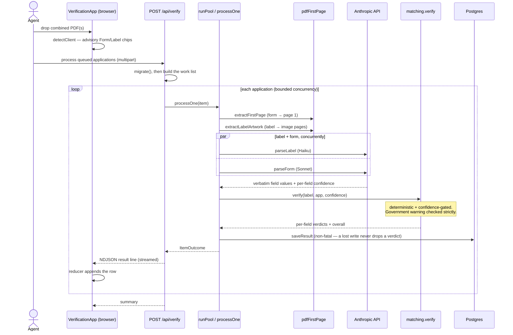

# Architecture

Three views of the system, from outside in:

1. **System context** — the app and the things outside it.
2. **Components** — the modules inside the app and how the two intake paths converge.
3. **Verification sequence** — what happens, in order, for one application.

The diagrams are Mermaid and render inline on GitHub. The guiding principle to
keep in mind while reading them: **the model transcribes verbatim; deterministic
code judges.** Every compliance decision lives in `lib/matching.ts`, never in a
prompt.

---

## 1. System context

A single Next.js deployable plus a database, talking to one external service (the
vision model) and — for CSV-by-URL intake only — arbitrary image hosts. The
dashed box is the trust/network boundary: the only required outbound traffic is
to the model API, which in a locked-down federal network must be allow-listed.

Notes:
- **No COLA integration** — this is a standalone proof-of-concept by design.
- **Retention:** only extracted text and verdicts are stored. Uploaded PDFs and
  label images (URL- or ZIP-sourced) are processed in memory and discarded.
- The CSV **ZIP-of-images** option avoids the `imgs` edge entirely, which is the
  safer choice when outbound fetching is restricted.

---

## 2. Components

Two intake fronts — **PDF** and **CSV** — converge on one shared spine
(`runPool` → `matching.verify` → `persistence`). The CSV path only swaps the
*front*: application data comes from columns instead of a form model-read, and
label images are resolved from URLs/ZIP instead of sliced from a PDF. From
matching onward the two paths are identical.

Reading aids:
- **`matching.verify` is the only judge.** Both fronts feed it; it reads the
  rules from `schema.ts` and resolves each field with a tolerant / numeric /
  strict matcher, gated by read confidence.
- **`extraction` is label/form-agnostic** — one shared model integration; the
  model id is a per-call argument (label defaults to a faster tier, form to the
  general one; see `config.ts`).
- **`detectClient` is advisory only** and runs in the browser; it never gates
  server-side processing.
- **`persistence` is a barrel** — the rest of the app imports from it, not from
  `db`/`persistWrite`/`persistQuery` directly.

---

## 3. Verification sequence (one PDF application)

The runtime view: detect → slice → transcribe (two models,
concurrently) → judge → persist → stream, with results flowing back per item
rather than after the whole batch (the per-label latency requirement).

**CSV variant.** Same diagram with the front swapped: instead of slicing a PDF
and model-reading the form, `csvParse` turns the row's columns into the
application data, and `imageFetch`/`zipImages` resolve the label images (from
URLs or the uploaded ZIP). The label is still model-read; `verify`, persistence,
streaming, and the shared `runPool` are identical.

---

## Why these choices

- **One vision model, not OCR-then-parse** — fewer moving parts; the model reads
  degraded artwork better than a brittle OCR pipeline.
- **Model transcribes, code judges** — verdicts are deterministic, testable, and
  auditable; the model can't "decide" compliance.
- **Confidence gate** — a low-confidence read routes to *review*, never a
  confident *fail*; the government warning is the deliberate exception.
- **Two paths, one judge** — PDF and CSV share matching, persistence, streaming,
  and the worker pool, so they can't drift.
- **Streaming over batch-blocking** — results land per application (~seconds),
  not after the whole batch.
- **Relational store, text + verdicts only** — portable across any Postgres;
  no document bytes retained.
